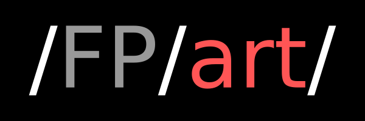
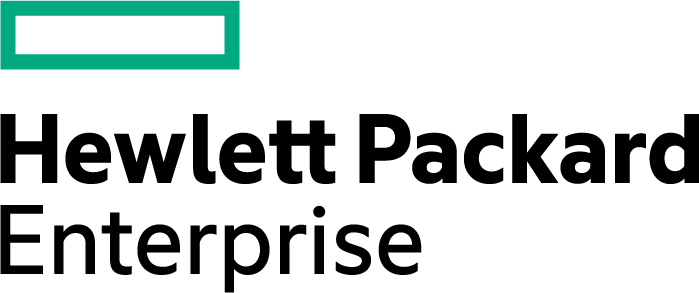

# About

Fpart is a **F**ilesystem **part**itioner. It helps you sort file trees and
pack them into bags (called "partitions"). It is developed in C and available
under the BSD license.

# Key features

## Fpart

* Blazing fast crawling!
* Generates partitions on a number/file number/size basis
* Provides a live mode with hooks to act immediately on generated file lists
* Supports generating partitions from arbitrary input (e.g. du's output)

## Fpsync

* Parallelizes rsync(1), cpio(1) or tar(1) jobs using fpart(1)
* Supports using a SSH cluster for efficient/distributed data migration
* Starts transfers while FS crawling still goes on
* Supports remote target URLs when using rsync(1)
* Parallelizes your final rsync(1) (--delete) pass too!
* Provides transfer runs' status/resume/replay
* Nearly no dependencies (mostly shell and common tools)
* Lower memory footprint (than raw tools)

# Compatibility

Fpart is primarily developed on FreeBSD.

It has been successfully tested on :

* FreeBSD (i386, amd64)
* GNU/Linux (x86_64, arm)
* Solaris 9, 10 (Sparc, i386)
* OpenIndiana (i386)
* NetBSD (amd64, alpha)
* Mac OS X 10.6, 10.8, 11.2 (x86_64, arm64)

and passed Coverity Scan tests with success.

# Installing from a package

Packages are already available for many operating systems :

* [FreeBSD](https://www.freshports.org/sysutils/fpart)
* [Debian](https://packages.debian.org/fpart)
* [Ubuntu](https://packages.ubuntu.com/search?keywords=fpart)
* [CentOS/Fedora](https://src.fedoraproject.org/rpms/fpart)
* [NixOS](https://search.nixos.org/packages?query=fpart)
* [MacOS (Homebrew)](https://formulae.brew.sh/formula/fpart)
* [Spack](https://packages.spack.io/package.html?name=fpart)

so you can use your favourite package manager to get ready.

# Installing from source

If a pre-compiled package is not available for your favourite operating system,
installing from sources is simple. First, get the source files :

    $ git clone "https://github.com/martymac/fpart.git"
    $ cd fpart

Then, if there is no 'configure' script in
the main directory, run :

    $ autoreconf -i

(autoreconf comes from the GNU autotools), then run :

    $ ./configure
    $ make

to configure and build fpart.

Finally, install fpart (as root) :

    # make install

# Author / Licence

Fpart has been written by [Ganael LAPLANCHE](mailto:ganael.laplanche@martymac.org)
and is available under the BSD license (see COPYING for details).

Source code is hosted on :

* [Martymac.org](http://contribs.martymac.org)
* [Github](https://github.com/martymac/fpart)
* [Sourceforge](http://www.sourceforge.net/projects/fpart)

Documentation is available on :

* [Fpart.org](http://www.fpart.org)

Thanks to Jean-Baptiste Denis for having given me the idea of this program !

# Third-party code

fts(3) code originally comes from FreeBSD :

    lib/libc/gen/fts.c -> src/fts.c
    include/fts.h      -> src/fts.h

It has been slightly modified for portability and is available under the BSD
license.

# Supporting fpart

If fpart (or fpsync) is useful to you or your organization, do not hesitate to
contribute back! You can follow ideas in the [TODO](https://github.com/martymac/fpart/blob/master/TODO)
file or just fix a bug, any kind of help is always welcome!

If you prefer, you can also make a donation on Paypal:

 

 

That will help me not running out of tea :)

# Fpart supporters

* Apple OSX support is eased by **MacStadium**'s Open Source Developer Program,
  big thanks to them!
* Many thanks to **HPE** for providing me the successor of my old server!
  That's what I call OSS support :)

 

[{: style="width:175px;margin-right:75px;margin-down:75px"}](https://www.macstadium.com/opensource/members)
[{: style="width:175px;margin-right:75px;margin-down:75px"}](https://www.hpe.com/us/en/open-source.html)

 

* Last but not least, big thanks to my **beloved wife and daughters** for their
  invaluable support and more particularly for the discussion we had about
  fpart logo :)
